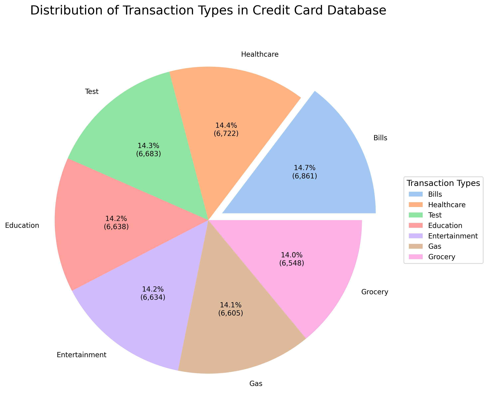
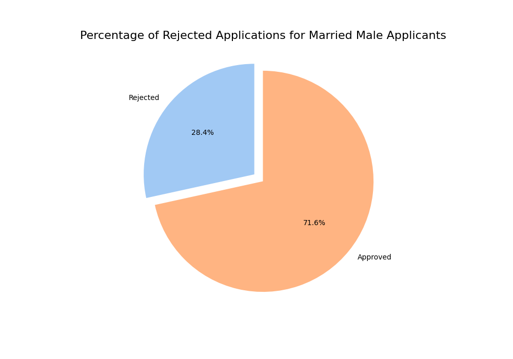
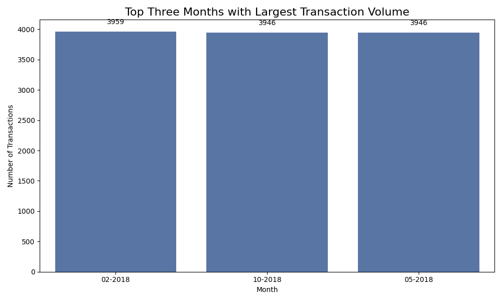

# Per Scholas Data Engineering Capstone

## Project Overview

This project is the capstone for the Per Scholas Data Engineering course. The goal is to demonstrate the application of data engineering principles, including data extraction, transformation, and loading (ETL), data analysis, and visualization.

## Project Structure

```
Per-Scholas-Data-Engineering-Capstone/
├── .gitignore
├── CAP 350 - Data Engineering - Capstone Project Requirements Document.docx
├── LICENSE
├── README.md
├── cc_&_loan_data_analysis_visualization.py
├── cc_data_analysis_visualization.py
├── cli.py
├── etl_credit_card_data.py
├── etl_loan_data_api.py
├── mysql_db_interactions.py
├── mysql_db_setup.py
├── requirements.txt
├── json/
│   ├── cdw_sapp_branch.json
│   ├── cdw_sapp_credit.json
│   ├── cdw_sapp_customer.json
└── visualizations/
    ├── 3.1_transaction_type_pie_chart.png
    ├── 3.2_top_10_states_by_customer_count.png
    ├── 3.3_top_10_customers_by_total_transaction_amt.png
    ├── 5.1_self_employed_approval_percentage.png
    ├── 5.2_married_male_rejection_percentage.png
    ├── 5.3_top_3_months_transaction_volume.png
    └── 5.4_top_branches_healthcare_transactions.png
```

## Setup Instructions

### Prerequisites

- Python 3.8-3.11 (PySpark currently doesn't work with Python 3.12)
- MySQL server
- Required Python packages (listed in `requirements.txt`)

### Installation

1. **Clone the repository:**
   ```sh
   git clone https://github.com/your-username/Per-Scholas-Data-Engineering-Capstone.git
   cd Per-Scholas-Data-Engineering-Capstone
   ```

2. **Install dependencies:**
   ```sh
   pip install -r requirements.txt
   ```

3. **Setup the MySQL database:**
   - Ensure your MySQL server is running.
   - You may run etl_credit_card_data.py to setup the MySQL database.

## Usage

### ETL Process

1. **Extract, Transform, and Load Credit Card Data:**
   ```sh
   python etl_credit_card_data.py
   ```

2. **Extract, Transform, and Load Loan Data:**
   ```sh
   python etl_loan_data_api.py
   ```

### Data Analysis and Visualization

1. **Credit Card Data Analysis and Visualization:**
   ```sh
   python cc_data_analysis_visualization.py
   ```

2. **Combined Credit Card and Loan Data Analysis and Visualization:**
   ```sh
   python cc_&_loan_data_analysis_visualization.py
   ```

### Command Line Interface

The `cli.py` script provides a command line interface for interacting with the project.

```sh
python cli.py
```

## Visualizations

The `visualizations/` directory contains PNG files of various data visualizations generated by the analysis scripts.

### Example Visualizations

1. **Transaction Type Pie Chart:**
   

2. **Top 10 States by Customer Count:**
   

3. **Top 10 Customers by Total Transaction Amount:**
   

4. **Self Employed Approval Percentage:**
   

5. **Married Male Rejection Percentage:**
   

6. **Top 3 Months Transaction Volume:**
   

7. **Top 10 Branches in Healthcare Transactions:**
   

## License

This project is licensed under the Unlicense.

## Acknowledgements

- Per Scholas for providing the guidance and framework for this capstone project.
- Instructors and peers for their support and feedback.
